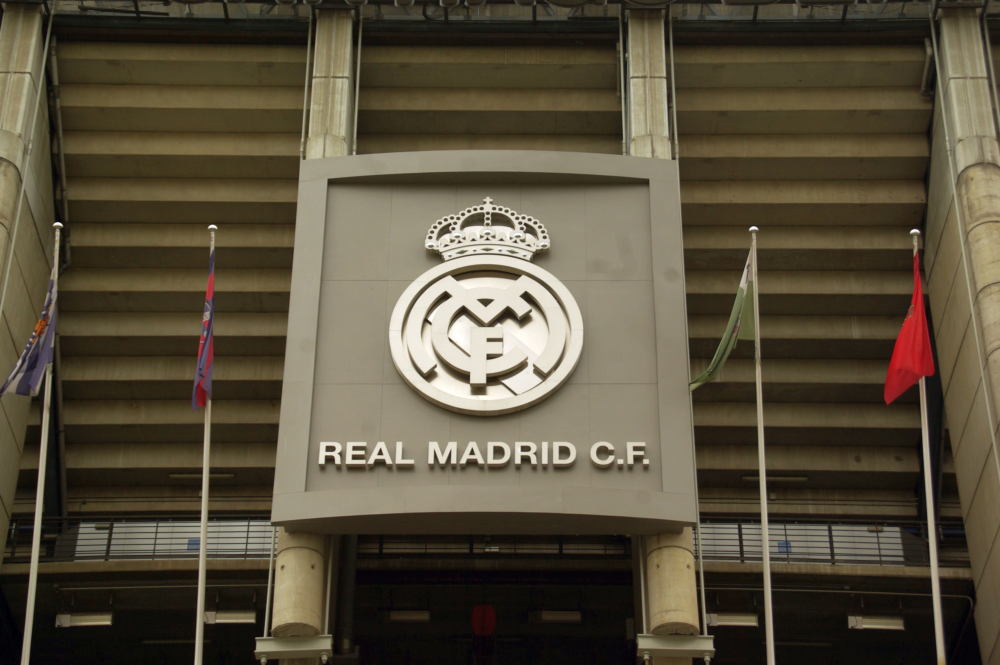

# Real Madrid Club de Fútbol

## Historia del club

El Real Madrid es uno de los clubes **más laureados** de la historia del fútbol.
Fue fundado el *6 de marzo de 1902* con el nombre de Madrid Football Club, y en 1920
el rey Alfonso XIII le concedió el título de "Real". Desde 1947 juega como local en el
estadio Santiago Bernabéu, situado en la ciudad de `Madrid`.

Momentos clave de su historia:

1. 1902: fundación del Madrid Football Club
2. 1920: el club recibe el título de "Real"
3. 1947: inauguración del estadio Santiago Bernabéu
4. 1956-1960: cinco Copas de Europa consecutivas
5. 1998-2002: tres Copas de Europa en cinco años
6. 2014-2018: cuatro Champions League en cinco años

## Títulos

Estos son los principales trofeos del club, según las fuentes consultadas en octubre de 2026:

```python
titulos = {
    "UEFA Champions League": 15,
    "LaLiga": 36,
    "Copa del Rey": 20,
    "Supercopa de España": 13,
}

for competicion, cantidad in titulos.items():
    print(f"{competicion}: {cantidad} títulos")
```

| Competición           | Títulos | Ámbito   |
|-----------------------|---------|----------|
| UEFA Champions League | 15      | Europeo  |
| LaLiga                | 36      | Nacional |
| Copa del Rey          | 20      | Nacional |
| Supercopa de España   | 13      | Nacional |

El club es el máximo ganador de la Champions League y de LaLiga.

## Jugadores más importantes

- **Alfredo Di Stéfano**: la gran estrella de las cinco primeras Copas de Europa
- **Ferenc Puskás**: delantero húngaro y goleador histórico de aquel equipo
- **Francisco Gento**: ganó seis Copas de Europa, un récord
- **Raúl González**: símbolo del club durante más de una década
- **Iker Casillas**: portero y capitán, ganó tres Champions
- **Cristiano Ronaldo**: máximo goleador histórico del club y cuatro Champions con el Madrid
- **Karim Benzema**: Balón de Oro en 2022

## Curiosidades

- Es un club de **socios**: pertenece a sus socios y no a un dueño privado.
- Sus apodos son *Los Blancos*, *Los Merengues* y *La Casa Blanca*.
- Su himno se llama `Hala Madrid`.
- Los títulos se celebran tradicionalmente en la fuente de la Cibeles.

## Enlaces

- Web oficial del club: [Real Madrid](https://www.realmadrid.com/)
- Más información en el [documento de detalles](docs/detalles.md)

## Imágenes

Imagen local (carpeta `assets`) de la fachada principal del estadio:



Imagen de Wikimedia Commons sobre mi instituto, el IES Clara del Rey, situado en Madrid, la misma ciudad del club:


